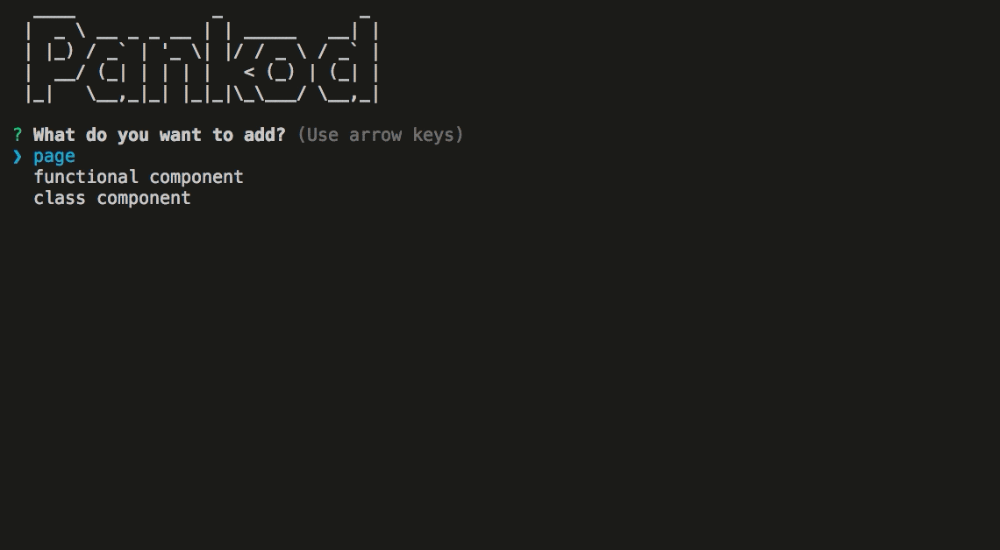

<div  align="center" >
<sub><a  href="[https://github.com/OpenPocket/](https://github.com/OpenPocket/client-ui)">Open Pocket</a></sub>
</div>

## About
About open pocket here.

## Getting Started
Clone this repo. Install with:
```
npm install
```
Run with:
```
npm run start:dev

```


## Built with
*  **Next.js** - Minimalistic framework for server-rendered React applications.

*  **Typescript** - Superset of JavaScript which primarily provides optional static typing, classes and interfaces.

*  **Redux** - State management

*  **Express.js**- Handles server-side rendering and integrated with Express.js

*  **Built-in Project CLI**- Create pages, components, actions, reducers with one command by using built-in cli.

*  **Sass/Scss** - CSS preprocessor, which adds special features such as variables, nested rules and mixins (sometimes referred to as syntactic sugar) into regular CSS.

*  **Docker** - A tool designed to make it easier to create, deploy, and run applications by using containers.

*  **Babel** - The compiler for next generation JavaScript.

*  **Eslint** - The pluggable linting utility.

*  **Reverse Proxy** - A reverse proxy server is a type of proxy server that typically sits behind the firewall in a private network and directs client requests to the appropriate backend server

*  **Bundler Analyzer** - Visualize size of webpack output files with an interactive zoomable treemap.

*  **dotenv .config** - Expose environment variables to the runtime config of Next.js

*  **Jest** - Javascript testing framework , created by developers who created react

*  **Enzyme** - JavaScript testing utility for React that makes it easier to test your React Components output.

*  **i18next** - An internationalization-framework which provides a function that takes a key, some options, and returns the value for the current language. Helps you to add language translation support to your app.


## Built-in CLI
<div>

</div>

  
Comes with the Pankod CLI tool to streamline the creation of new components. By using the CLI tool, you may easily add pages, class components or functional components to your project and have all the required actions, reducers and imports are automatically created for you.

To start the CLI, you may run the following npm command:  

```

npm run cli

```


After starting, an interactive menu will let you configure the component the be created. Firstly, you'll be asked for the type of the component whether it's a page, functional component or class component. Then you'll be prompted with the other options relevant to your selection of the component type.

  
  

After answering questions it generates files in miliseconds.


  

## License
Licensed under the GPLV3 License, Copyright © 2019-Present Open Pocket